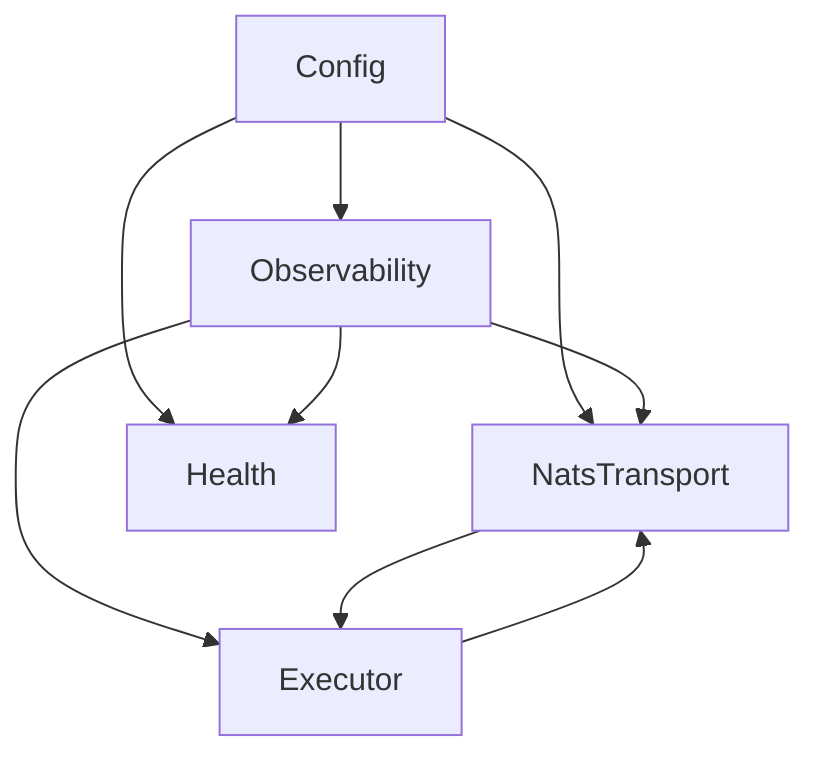

# Architecture: Worker

## Modules

## Module Responsibilities

1.  **Config**: Loads configuration from Environment Variables.
2.  **Observability**: Structured JSONL logging, PII filtering.
3.  **NatsTransport**: Manages NATS connection, subscriptions, and message parsing.
4.  **Executor**: Handles business logic for task execution (placeholder for now).
5.  **Health**: HTTP endpoint for readiness/liveness checks.
